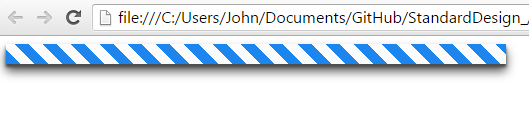

# StandardDesigns
LESS components used to build quick, consistent web components. 

Currently, files are broken into two groups: base_ and components_

<h3>Using autoload.less</h3>

autoload.less contains a list of generated import statements so you will only need to use `@import "autoload.less";`

If you make changes to `lib_`, run `node loadLibrary.js` in order to recompile the autoload.less file

Without calling any modules (as demonstrated below), your generated css file `lessc myLessFile.less myCssFile.css` should look like:

````css
    html,body {
        height: 100vh;
    }
    
    *,*::before,*::after {
        box-sizing: border-box;
        padding: 0;
        margin: 0;
        z-index: 0;
        border: none;
        outline: none;
        background: none;
    }
    
    @font-face {
        font-family: "OpenSans";
        src: url('https://fonts.googleapis.com/css?family=Open+Sans:200,400,600');
    }

````

<h3>Base_</h3>

These are simple base modules from which components can be created. 

Files starting with an underscore, such as _colors.less, contain styling which are used by other base components.

All other files in base_ strive to do their respective tasks with minimal side effects while covering as many style
configurations as possible. Through modulating styles in this manner, we can achieve a more consistent visual and, replacing
or extending base modules requires minimal refractoring.


Base modules are namespaced and follow the convention `#standard{module} > mixin()`. In this way, you may build the following
component to create a progress bar:

```less
    .myProgressBar {
        #standardDepth > .addMaterialDepth();
        #standardShapes > .sized-Rectangle(@height: 20px, @width: 500px);
        #standardGradients > .stripedGradient(@blue, @white);
    }
```

This code compiled becomes 

```css
    .myProgressBar {
        box-shadow: 0 1px 3px #757575, 0 1px 2px #5b5b5b;
        transition: all 0.2s ease-in-out;
        height: 20px;
        width: 500px;
        border-radius: 0;
        background: repeating-linear-gradient(45deg, #1C86EE, #1C86EE 10px, #FCFCFC 10px, #FCFCFC 20px);
    }
    
    .myProgressBar:hover {
        box-shadow: 0 7px 14px #4f4f4f, 0 3px 3px #424242;
    }
    
    .myProgressBar:active {
        box-shadow: 0 7px 14px #474747, 0 3px 3px #3a3a3a;
    }

```



<h3>Components_</h3>

These are components created from base modules and additional stylings which form final, or near final, widgets and components
for creating web interfaces. As much as possible, components should simply contain a list of base mixins which create the component's
look. In doing so, managing a visual consistency becomes much more managable. 

